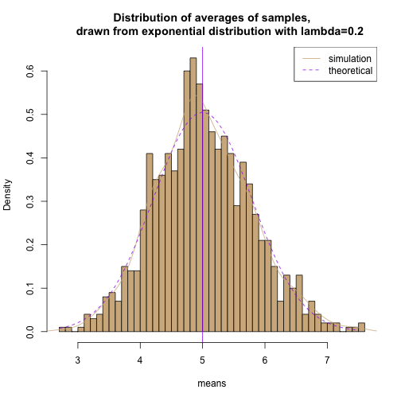

Statistical Inference Course Project
========================================
Part 1: Simulation Exercises
========================================
Mahantesh Pattanshetti 
----------------------

### Overview:
In this project, we will investigate the exponential distribution in R and compare it with the Central Limit Theorem. The exponential distribution can be simulated in R with rexp(n, lambda) where lambda is the rate parameter. The mean of exponential distribution is 1/lambda and the standard deviation is also 1/lambda. 

Using simulations, we will compare 
- compare sample mean to the theoretical mean of the distribution
- compare sample variance to the theoretical variance of the distribution
- show that the distribution is approximately normal.

### Simulations:
Create 1000 simuations with $\lambda=0.2$,and sample size=40 


```r
set.seed(500)
lambda <- 0.2
numSimulations <- 1000
sampleSize <- 40
sim <- matrix(rexp(numSimulations*sampleSize, rate=lambda), numSimulations, 
              sampleSize)
rMeans <- rowMeans(sim)
```
### Sample Mean versus Theoretical Mean: 

The distribution of sample means is: 

```r
mean(rMeans)
```

```
## [1] 5.010562
```

The theoretical mean of the distribution is $\lambda^{-1}$ is 

```r
1/lambda
```

```
## [1] 5
```

### Sample Variance versus Theoretical Variance: 

The variance of sample means is:

```r
var(rMeans)
```

```
## [1] 0.6003934
```
The theoretical variance of the distribution is $\sigma^2 / n = 1/(\lambda^2 n) = 1/(0.04 \times 40)$ =

```r
1/(0.04 * 40)
```

```
## [1] 0.625
```
### Distribution:

The distribution of sample means:


```r
# plot the histogram of averages
hist(rMeans, breaks=50, prob=TRUE,
     main="Distribution of averages of samples,
     drawn from exponential distribution with lambda=0.2",
     col="tan",xlab = "means")
# density of the averages of samples
lines(density(rMeans),col="tan")
# theoretical center of distribution
abline(v=1/lambda, col="purple")
# theoretical density of the averages of samples
xfit <- seq(min(rMeans), max(rMeans), length=100)
yfit <- dnorm(xfit, mean=1/lambda, sd=(1/lambda/sqrt(sampleSize)))
lines(xfit, yfit, pch=22, col="purple", lty=2)
# add legend
legend('topright', c("simulation", "theoretical"), lty=c(1,2), 
       col=c("tan", "purple"))
```

 

As per the central limit theorem,the arithmetic mean of a sufficiently large number of iterates of independent random variables will be approximately normally distributed regardless of the underlying distribution. In this case underlying distribution is exponential, but the distribution of sample means is normal as seen above.  The q-q plot below also show normality. 


```r
qqnorm(rMeans); qqline(rMeans)
```

 


github: 
https://github.com/Mahantp/Coursera_Statistical_Inference
