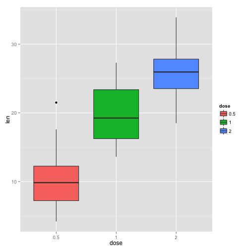
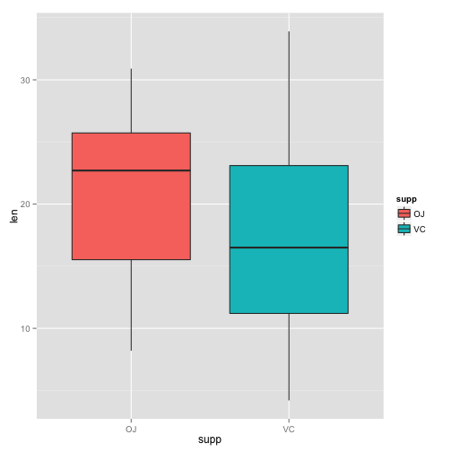

Statistical Inference Course Project
========================================
Part 2: Analyze The ToothGrowth Data 
========================================
Mahantesh Pattanshetti 
----------------------

### 1) Load the ToothGrowth data and perform some basic exploratory data analyses.

```r
library(datasets)
library(ggplot2)
data(ToothGrowth)
```

Take a look at the dataset variables

```r
str(ToothGrowth)
```

```
## 'data.frame':	60 obs. of  3 variables:
##  $ len : num  4.2 11.5 7.3 5.8 6.4 10 11.2 11.2 5.2 7 ...
##  $ supp: Factor w/ 2 levels "OJ","VC": 2 2 2 2 2 2 2 2 2 2 ...
##  $ dose: num  0.5 0.5 0.5 0.5 0.5 0.5 0.5 0.5 0.5 0.5 ...
```

```r
head(ToothGrowth)
```

```
##    len supp dose
## 1  4.2   VC  0.5
## 2 11.5   VC  0.5
## 3  7.3   VC  0.5
## 4  5.8   VC  0.5
## 5  6.4   VC  0.5
## 6 10.0   VC  0.5
```

We can see that dose has only three values. Convert variable dose from numeric to factor

```r
ToothGrowth$dose <- as.factor(ToothGrowth$dose)
```

### 2) Provide a basic summary of the data.

Summary statistics for all variables

```r
summary(ToothGrowth)
```

```
##       len        supp     dose   
##  Min.   : 4.20   OJ:30   0.5:20  
##  1st Qu.:13.07   VC:30   1  :20  
##  Median :19.25           2  :20  
##  Mean   :18.81                   
##  3rd Qu.:25.27                   
##  Max.   :33.90
```

Split the data set  between different dose levels and delivery methods and create graphs

```r
table(ToothGrowth$dose, ToothGrowth$supp)
```

```
##      
##       OJ VC
##   0.5 10 10
##   1   10 10
##   2   10 10
```

```r
ggplot(aes(x=dose, y=len), data=ToothGrowth) + geom_boxplot(aes(fill=dose))
```

 

```r
ggplot(aes(x=supp, y=len), data=ToothGrowth) + geom_boxplot(aes(fill=supp))
```

 
### 3) Run T Tests and check for confidence interval 
Tests and confidence interval for two different supplement type:

```r
t.test(len ~ supp, data = ToothGrowth)
```

```
## 
## 	Welch Two Sample t-test
## 
## data:  len by supp
## t = 1.9153, df = 55.309, p-value = 0.06063
## alternative hypothesis: true difference in means is not equal to 0
## 95 percent confidence interval:
##  -0.1710156  7.5710156
## sample estimates:
## mean in group OJ mean in group VC 
##         20.66333         16.96333
```

The p-value is 0.06, and the confidence interval contains zero. This indicates that we can not reject the null hypothesis that the different supplement types have no effect on tooth length.


Create dose level pairs and run t tests for each dose level pair & check for confidence interval

```r
DosePair_1 <- subset (ToothGrowth, dose %in% c(0.5, 1.0)) 
DosePair_2 <- subset (ToothGrowth, dose %in% c(1.0, 2.0)) 
```

Tests and confidence interval for dose level pair - 0.5 to 1.0


```r
t.test(len ~ dose, data = DosePair_1)
```

```
## 
## 	Welch Two Sample t-test
## 
## data:  len by dose
## t = -6.4766, df = 37.986, p-value = 1.268e-07
## alternative hypothesis: true difference in means is not equal to 0
## 95 percent confidence interval:
##  -11.983781  -6.276219
## sample estimates:
## mean in group 0.5   mean in group 1 
##            10.605            19.735
```
Tests and confidence interval for dose level pair - 1.0 to 2.0


```r
t.test(len ~ dose, data = DosePair_2)
```

```
## 
## 	Welch Two Sample t-test
## 
## data:  len by dose
## t = -4.9005, df = 37.101, p-value = 1.906e-05
## alternative hypothesis: true difference in means is not equal to 0
## 95 percent confidence interval:
##  -8.996481 -3.733519
## sample estimates:
## mean in group 1 mean in group 2 
##          19.735          26.100
```

For both two dose level pairs, the p-value is less than 0.05, and the confidence interval does not contain zero. Null hypothesis can be rejected. This implies that the mean tooth length increases on raising the dose level. 

### 4) State your conclusions and the assumptions needed for your conclusions.

Conclusions

Supplement type has no effect on tooth growth.
Increasing the dose level leads to increased tooth growth.

Assumptions:
- Guinea pigs sample is representative of population.There were no biases in picking the sample of pigs. 

- The dosage asssignment to Guinea pigs was done with random assignment. There were no biases in dosage allocation to any particular pig. 

- The variances are assumed to be different for the two groups being compared.


github: 
https://github.com/Mahantp/Coursera_Statistical_Inference
